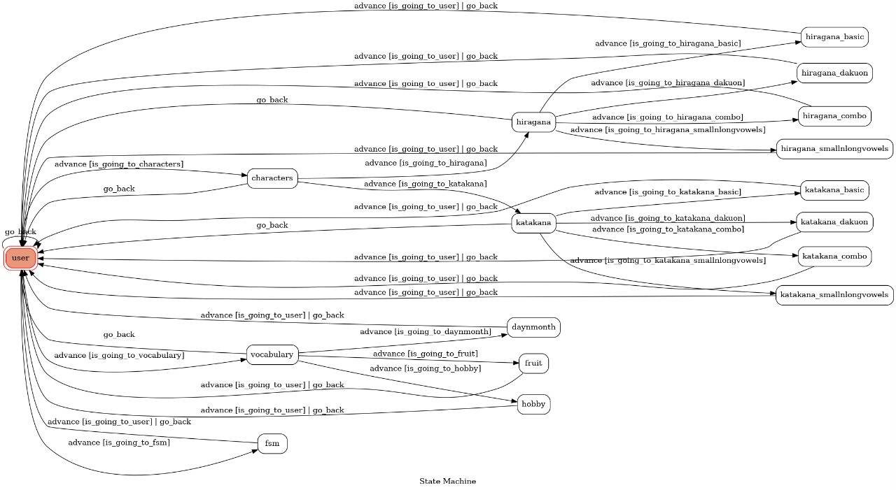
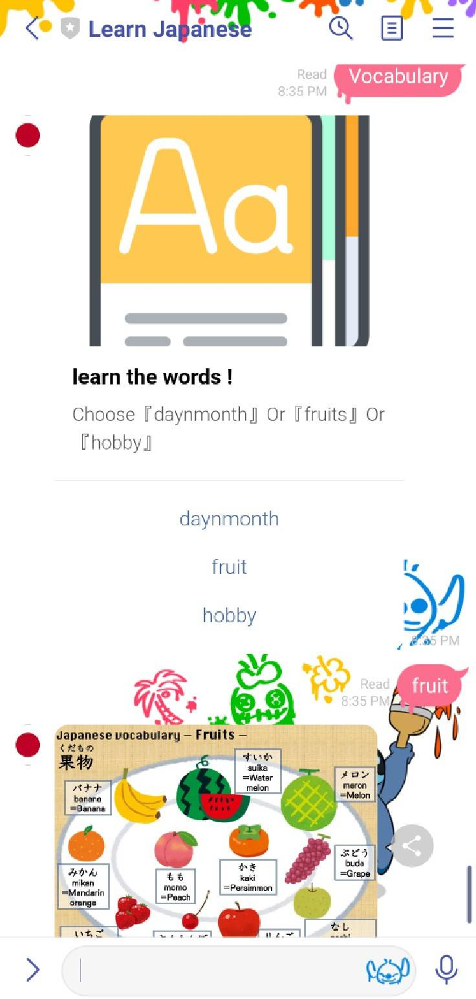

# Learn Japanese - TOC Project 2021

A Line bot based on a finite state machine to learn basic japanese skills

## Finite State Machine


## How to use
The initial state is set to `user`.

### States
* user
* characters
* hiragana
* katakana
* hiragana_basic
* hiragana_dakuon
* hiragana_combo
* hiragana_smallnlongvowels
* katakana_basic
* katakana_dakuon
* katakana_combo
* katakana_smallnlongvowels
* vocabulary
* daynmonth
* fruit
* hobby


The user will be asked to choose from 『Characters』/『Vocabulary』/『FSM』

if the user choose 『Characters』

	There will be another options such as 『Hiragana』/『Katakana』
	
		Each 『Hiragana』/『Katakana』have their own options, which are『Basic』/『Dakuon』/『Combo』/『SL-Vowels』
		
			The corresponding images will then be shown
			
if the user choose 『Vocabulary』.

	There will be another options such as 『daynmonth』/『fruits』/『hobby』
	
		The corresponding images will then be shown
		
if the user choose 『FSM』.

	a FSM graph will be shown 
	
## Deploy in Heroku
Setting to deploy webhooks on Heroku.

### Heroku CLI installation

* [macOS, Windows](https://devcenter.heroku.com/articles/heroku-cli)

or you can use Homebrew (MAC)
```sh
brew tap heroku/brew && brew install heroku
```

or you can use Snap (Ubuntu 16+)
```sh
sudo snap install --classic heroku
```

### Connect to Heroku

1. Register Heroku: https://signup.heroku.com

2. Create Heroku project from website

3. CLI Login

	`heroku login`

### Upload project to Heroku

1. Add local project to Heroku project

	heroku git:remote -a {HEROKU_APP_NAME}

2. Upload project

	```
	git add .
	git commit -m "Add code"
	git push -f heroku master
	```

3. Set Environment - Line Messaging API Secret Keys

	```
	heroku config:set LINE_CHANNEL_SECRET=your_line_channel_secret
	heroku config:set LINE_CHANNEL_ACCESS_TOKEN=your_line_channel_access_token
    heroku config:set APP_KEY=your_olami_APP_KEY
    heroku config:set APP_SECRET=your_olami_APP_SECRET
	```

4. Your Project is now running on Heroku!

	url: `{HEROKU_APP_NAME}.herokuapp.com/callback`

	debug command: `heroku logs --tail --app {HEROKU_APP_NAME}`

5. If fail with `pygraphviz` install errors

	run commands below can solve the problems
	```
	heroku buildpacks:set heroku/python
	heroku buildpacks:add --index 1 heroku-community/apt

## Images



